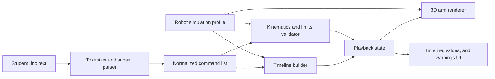

# Architecture

## Design principles

- **Static and local-first:** the first release should be deployable as static
  browser files and should not require a backend.
- **Deterministic:** identical code and configuration must produce the same
  command timeline and arm poses.
- **Safe parsing:** student code is treated as text, never as executable browser
  code.
- **Separation of concerns:** parsing, timing, kinematics, validation, and 3D
  rendering must be testable independently.
- **Small dependency surface:** select libraries only when they materially
  reduce complexity or improve reliability.

## Data flow



## Proposed modules

The names below describe responsibilities, not a selected framework or final
directory structure.

### Application shell

Owns layout, sample selection, editor input, configuration controls, and error
boundaries. It coordinates modules but contains no kinematics formulas.

### Tokenizer and parser

Converts the documented sketch subset into typed commands. It must preserve
source line and column information. It must understand comments well enough to
avoid animating commented-out examples or TODO lines.

It must not use regular expressions alone to interpret the complete file.
Regular expressions may be used after lexical handling for narrow numeric or
identifier validation.

### Command model

The parser produces a small intermediate representation such as:

```text
MoveXYZ { x, y, z, sourceLocation }
Delay { milliseconds, sourceLocation }
OpenClaw { sourceLocation }
CloseClaw { sourceLocation }
Begin { pins, sourceLocation }
```

Commands retain numeric source text when useful for error messages. The model
contains no 3D-renderer objects.

### Timeline builder

Transforms commands into deterministic time segments. Movement segments follow
the MeArm interpolation and delay behavior defined in `SKETCH_LANGUAGE.md`.
Explicit delays and claw delays remain separate segments so the UI can explain
where time is spent.

### Kinematics engine

Implements inverse and forward kinematics independently of the view. It uses a
profile containing link lengths and servo limits. Its outputs include:

- requested Cartesian position,
- solved joint angles,
- reconstructed Cartesian position,
- reachability status,
- servo-limit status,
- diagnostic reason when invalid.

The formulas should be traceable to `ik.cpp` and `fk.cpp` in the source MeArm
library. Tests will compare known points and round trips against that behavior.

### Playback controller

Owns simulation time, repeat behavior, play/pause, speed, stepping, and
scrubbing. Rendering reads playback state; it does not advance time itself.
This keeps tests independent of graphics frame rate.

### 3D renderer

Builds the arm as a transform hierarchy:

```text
world
└── base rotation
    └── shoulder offset
        └── shoulder rotation / upper arm
            └── elbow rotation / forearm
                └── wrist/hand
                    ├── left claw finger
                    └── right claw finger
```

The first model may use simple geometric primitives. Accurate motion and clear
joint relationships take priority over photorealism.

### Validation and diagnostics UI

Maps parser and kinematics diagnostics back to source lines. Diagnostic objects
use stable codes, plain-language messages, severity, and relevant values so
they can be tested without relying on rendered text.

## Configuration model

A versioned simulation profile should include:

```text
profile version
L1, L2, L3
home x, y, z
base angle min/max
shoulder angle min/max
elbow angle min/max
claw open/closed display values
movement step distance and delay
claw command delay
approved classroom poses
```

Profiles are untrusted input and require numeric range validation. Import and
export are not required for the first release.

## Error handling

- Lexing errors identify the source line and prevent timeline creation.
- Unsupported statements inside `loop()` identify the statement and explain
  the supported alternatives.
- Invalid numeric values such as negative delays or non-finite coordinates are
  rejected.
- IK failures retain the last valid physical pose and stop normal playback.
- A renderer failure must leave textual command and diagnostic information
  visible when possible.

## Security and privacy

- Never evaluate pasted code with `eval`, `Function`, dynamic script tags, or a
  C++ execution service.
- Do not upload sketch text, configuration, or analytics by default.
- Escape all student text rendered into the page.
- Keep dependencies pinned and review production dependency licenses.
- Offline operation is a product requirement, not only an optimization.

## Technology selection criteria

Libraries and tools will be selected only after this documentation phase. The
evaluation should prefer:

- a mature browser 3D API with transform hierarchies and orbit controls,
- a small build output with tree-shaking,
- fast unit tests for pure TypeScript or JavaScript modules,
- an accessible UI that does not require a large component framework,
- current long-term maintenance and compatible licenses,
- straightforward static hosting and offline asset bundling.

The resulting decision and rejected alternatives should be recorded before
implementation begins.
