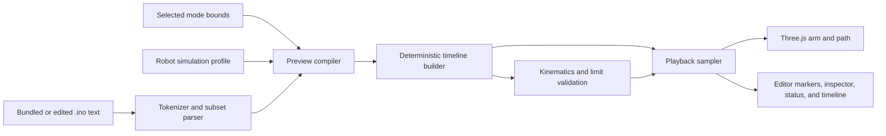

# Architecture

## Design principles

- **Static and local-first:** the application builds to browser files and does
  not require a backend.
- **Deterministic:** identical source and profile values produce the same
  commands, timing, poses, and diagnostics.
- **Safe parsing:** student code is tokenized as text and is never evaluated as
  JavaScript or compiled as arbitrary C++.
- **Separated core and view:** parsing, timing, kinematics, and profile
  validation remain independent of Three.js and the DOM.
- **Small dependency surface:** Three.js is the only production dependency.

## Runtime data flow



`compilePreview()` is the application boundary around profile validation,
parsing, optional Free form bounds, and timeline creation. A failed compile
returns a stable code and a beginner-readable message; source errors also
include a line and column. Playback controls are disabled until a new valid
preview exists, so an old timeline cannot be mistaken for the edited source.

## Implemented modules

### Application shell — `src/main.ts`

Builds the interface, loads the three samples, tracks the active mode and
profile, compiles edits, coordinates playback, and updates the 3D scene and
inspector. It also owns editor line selection, command checkpoints, camera and
visibility controls, copyable presets, keyboard shortcuts, and the settings
dialog.

### Preview helpers — `src/app/`

- `preview.ts` validates profile values, applies optional coordinate bounds,
  converts settings fields to a `RobotProfile`, and normalizes parser errors
  for the UI.
- `highlight.ts` produces escaped Arduino syntax-highlighting markup while the
  native textarea remains the editable accessible control.

### Deterministic core — `src/core/`

- `parser.ts` tokenizes the documented subset, ignores comments and include
  lines, and creates typed commands with source locations.
- `profile.ts` defines the versioned default profile and validates geometry,
  timing, HOME, and angle ranges.
- `kinematics.ts` solves inverse and forward kinematics and distinguishes
  unreachable geometry from configured servo-limit violations.
- `timeline.ts` executes setup once, expands movement and claw calls into timed
  samples, validates every movement point, and stops at the first invalid
  command.
- `types.ts` contains the command, state, diagnostic, profile, and timeline
  contracts shared by the application and viewer.
- `index.ts` is the public core export surface.

The core imports neither Three.js nor browser UI APIs, so it is directly
covered by Vitest.

### Viewer — `src/viewer/`

- `playback.ts` deterministically samples a timeline at a requested simulated
  time and extracts path points and unique destinations.
- `arm-model.ts` builds the base, links, hand, claw, and path as a transform
  hierarchy and applies joint angles and status materials.
- `scene.ts` owns the renderer, camera, OrbitControls, lights, grid, axes,
  coordinate labels, visibility controls, resizing, and resource disposal.
- `task-space.ts` maps the six faces of the active servo-limit domain through
  forward kinematics and owns the translucent boundary mesh and parameter grid.

The model uses simple geometry to explain joint relationships; it is not a CAD
or rigid-body physics model.

## Command model

The parser produces a small intermediate representation:

```text
Move { target, sourceLocation }
Snap { target, sourceLocation }
Delay { milliseconds, sourceLocation }
OpenClaw { sourceLocation }
CloseClaw { sourceLocation }
Begin { pins, sourceLocation }
```

Renderer objects never enter this representation. This keeps source parsing
and timeline behavior reproducible without WebGL.

## Simulation profile

The version 1 profile contains:

- `L1`, `L2`, and `L3` link dimensions;
- HOME `x`, `y`, and `z`;
- base, shoulder, and elbow minimum/maximum angles;
- movement step distance and delay;
- claw command delay; and
- the approved classroom poses.

The settings dialog currently exposes geometry, HOME, and angle limits. Timing
and approved poses remain code-defined. Applying settings reparses the current
sketch and recreates the arm geometry. Profiles affect the preview only; there
is no hardware connection or persisted calibration.

Free form mode adds a separate inclusive coordinate envelope before normal
kinematic validation: X `-100..100`, Y `100..200`, and Z `0..150` millimeters.
The instructor and student modes do not apply this extra envelope, although all
modes still use reachability and servo-limit validation.

## Failure handling

- Tokenization and parsing errors prevent timeline creation and identify the
  source location when one exists.
- Invalid profiles fail before parsing.
- Empty loops fail preview creation.
- An out-of-bounds Free form coordinate identifies its axis, range, value, and
  source line.
- The timeline retains the last valid state and stops at the first invalid
  movement sample.
- Failed preview compilation pauses and disables playback controls.
- Recompiling disposes the prior Three.js scene before creating the next one.

## Security, privacy, and offline behavior

- No `eval`, `Function`, dynamic script injection, or C++ execution service is
  used.
- Student source and profile values stay in the browser; there is no upload,
  account, analytics, or application backend.
- Syntax highlighting escapes source before inserting markup.
- Vite bundles application assets into `dist/`; `scripts/verify-offline.mjs`
  rejects external document or CSS asset references and checks release CSS
  contracts.

## Build and test stack

- TypeScript 7 with strict checking
- Vite 8 for development and static builds
- Vitest 4 for unit, integration, and source-level interface contracts
- Three.js 0.185 for rendering, OrbitControls, and CSS2D labels

See [TECHNOLOGY_DECISION.md](TECHNOLOGY_DECISION.md) for the decision record and
[TESTING_AND_SAFETY.md](TESTING_AND_SAFETY.md) for validation boundaries.
